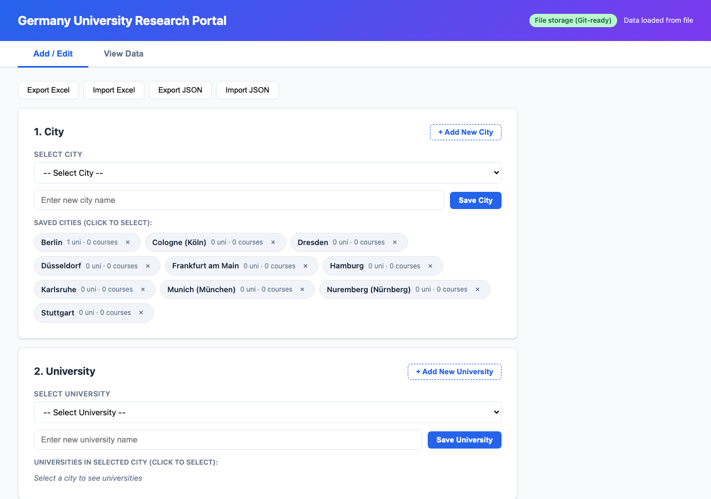
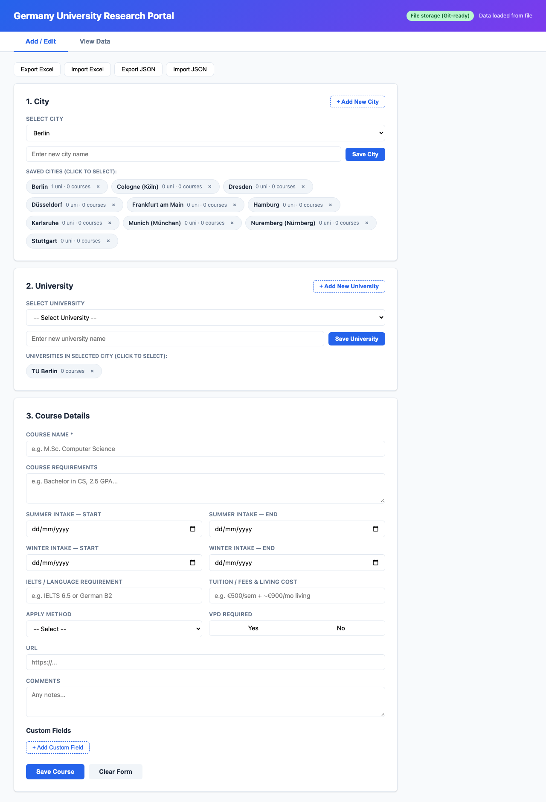
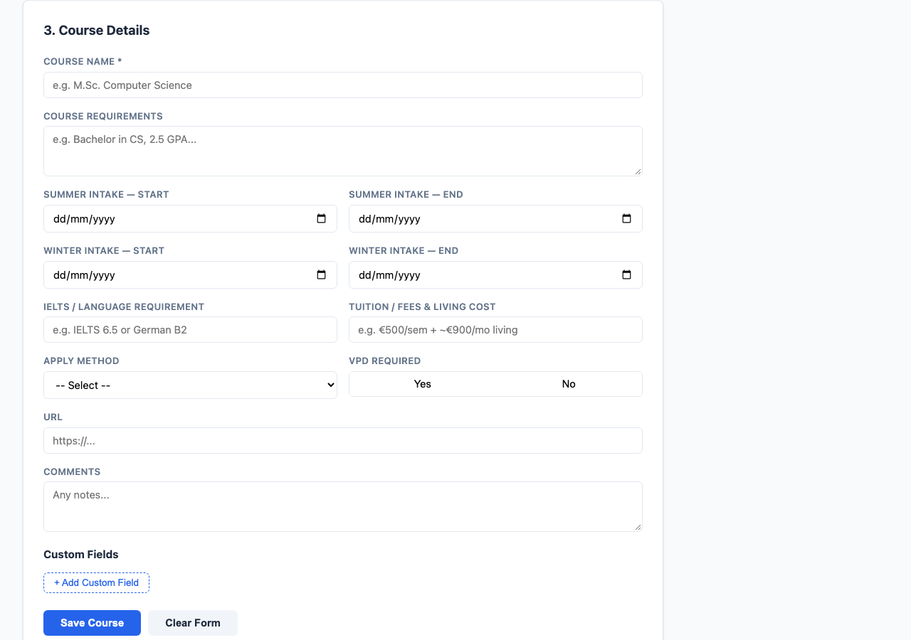
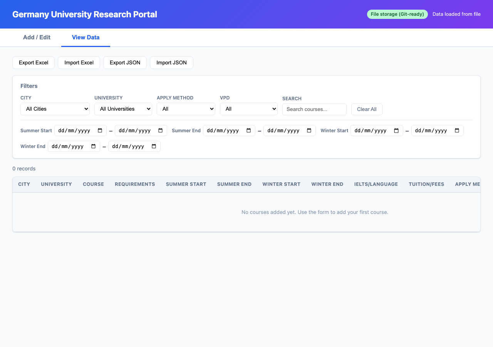

# Germany University Research Portal

A personal research portal for tracking German universities and courses you're considering applying to. Built as a lightweight, self-contained web app with no frameworks — just vanilla HTML, CSS, and JavaScript.


## Features

- **Hierarchical data model** — City → University → Course, with each level independently saveable
- **10 pre-loaded German tech cities** — Munich, Berlin, Hamburg, Frankfurt, Stuttgart, Düsseldorf, Cologne, Karlsruhe, Nuremberg, Dresden
- **City priority levels** — Color-coded chips (High/Medium/Low) to distinguish top-priority cities at a glance
- **Stepped form** — Add cities, universities, and courses independently (no need to fill the entire form just to save a city)
- **Spreadsheet-style table view** — Sortable columns, filters (city, university, apply method, VPD, free-text search, date ranges), record counts
- **Custom fields** — Add any number of ad-hoc label/value pairs per course; they appear as extra columns in the table and Excel exports
- **File-based storage** — Data saves to `data.json` for Git collaboration; falls back to browser localStorage when running without the server
- **Excel import/export** — Full `.xlsx` support via SheetJS with merge-or-replace on import
- **JSON import/export** — Lossless backup for exact data round-trips
- **Auto-save** — Every change persists immediately with a visible "last saved" timestamp

## Quick Start

### Option 1: With Server (Recommended for collaboration)

```bash
git clone <your-repo-url>
cd university-portal
node server.js
```

Open [http://localhost:3456](http://localhost:3456) in your browser. All data saves to `data.json` — commit and push it to share with collaborators.

### Option 2: Without Server (Standalone)

Double-click `index.html` to open directly in Chrome. Data saves to browser localStorage (local to your machine only).

## How It Works

### Storage Modes

| Mode | How to run | Data location | Collaboration |
|------|-----------|---------------|---------------|
| **File mode** | `node server.js` → open `localhost:3456` | `data.json` in project root | Commit & push `data.json` via Git |
| **Browser mode** | Double-click `index.html` | Browser localStorage | Single machine only |

The app auto-detects which mode it's in and shows a badge in the header:
- **Green badge** — "File storage (Git-ready)" — data saves to `data.json` + localStorage
- **White badge** — "Browser storage only" — data saves to localStorage only

### Collaboration via Git

1. Everyone clones the repo and runs `node server.js`
2. Add your research data through the portal
3. Commit `data.json` and push
4. Others pull to get the latest data
5. Merge conflicts in `data.json` are standard JSON — resolve as needed

## Usage Guide

### Adding Data

The form is split into three stepped cards:

**Step 1: City**
- Select an existing city from the dropdown, or click **"+ Add New City"** to create one
- Assign a priority level (High, Medium, or Low) — cities are color-coded: red for High, amber for Medium, gray for Low
- Click **"Save City"** — no other fields needed
- City chips show at a glance how many universities and courses each city has, sorted by priority

**Step 2: University**
- Select a city first, then pick a university or add a new one
- Click **"Save University"** — independent of the course form
- University chips show the course count

**Step 3: Course Details**
- Select both a city and university, then fill in course details
- Required fields: City, University, Course name
- Optional fields: requirements, intake dates, IELTS/language, tuition, apply method, VPD, URL, comments
- Add custom fields with **"+ Add Custom Field"** for any extra info (e.g., "Scholarship info: DAAD eligible")

### Viewing & Filtering Data

Switch to the **"View Data"** tab to see all courses in a spreadsheet-style table:

- **Filter dropdowns** — City, University, Apply Method, VPD Required
- **Free-text search** — Searches across course name, requirements, comments, and custom fields
- **Date range filters** — Filter by summer/winter intake start and end dates
- **Sortable columns** — Click any column header to sort ascending/descending
- **Record count** — Shows "X of Y records shown" when filters are active
- **Edit/Delete** — Per-row action buttons; Edit loads the record back into the form

### Import & Export

| Action | Format | Use case |
|--------|--------|----------|
| **Export Excel** | `.xlsx` | Share with others, open in Excel/Google Sheets |
| **Import Excel** | `.xlsx` | Load data from a spreadsheet (merge or replace) |
| **Export JSON** | `.json` | Lossless backup, exact data round-trip |
| **Import JSON** | `.json` | Restore from backup or migrate between setups |

Excel import is tolerant of column mismatches — it maps by header name and skips unknown columns. Custom fields export as flat columns (one per label), never as `[object Object]`.

## Data Model

```
City
 └── University
      └── Course
           ├── Course requirements (free text)
           ├── Summer intake: start date, end date
           ├── Winter intake: start date, end date
           ├── IELTS / language requirement
           ├── Tuition/fees & living cost
           ├── Apply method: Uni-Assist | University website | Other
           ├── VPD required: Yes / No
           ├── URL (clickable link)
           ├── Comments
           └── Custom fields (zero or more label/value pairs)
```

## Pre-loaded Cities

These 10 German tech hub cities are loaded on first run:

| City | Known for |
|------|-----------|
| Munich (München) | BMW, Siemens, Google, Apple, Microsoft — highest salaries |
| Berlin | Largest startup ecosystem in Europe — fintech, e-commerce, AI |
| Hamburg | E-commerce (Otto, About You), gaming, media tech |
| Frankfurt am Main | Financial tech center — banks, consultancies, fintech |
| Stuttgart | Automotive tech (Mercedes, Porsche, Bosch) — embedded systems, IoT |
| Düsseldorf | Enterprise software, consulting, telecom (Vodafone HQ) |
| Cologne (Köln) | Gaming (EA, Ubisoft), media tech, insurance IT |
| Karlsruhe | KIT university, software engineering, cybersecurity, SAP nearby |
| Nuremberg (Nürnberg) | Siemens Healthineers, Datev — affordable living |
| Dresden | "Silicon Saxony" — Europe's largest semiconductor cluster |

You can add more cities at any time through the portal.

## Project Structure

```
university-portal/
├── index.html      # Page structure and layout
├── styles.css      # All styling
├── app.js          # Client-side logic (CRUD, filters, import/export)
├── server.js       # Tiny Node.js server for file-based storage
├── data.json       # Shared data file (auto-created, commit to Git)
└── README.md
```

## Requirements

- **Any modern browser** (Chrome, Firefox, Edge, Safari)
- **Node.js 18+** (only needed for file-based storage mode)
- No npm install, no build tools, no dependencies to manage

## Screenshots

### Main View — City Management


### City & University Selection


### Course Details Form


### Table View with Filters



## License

MIT
